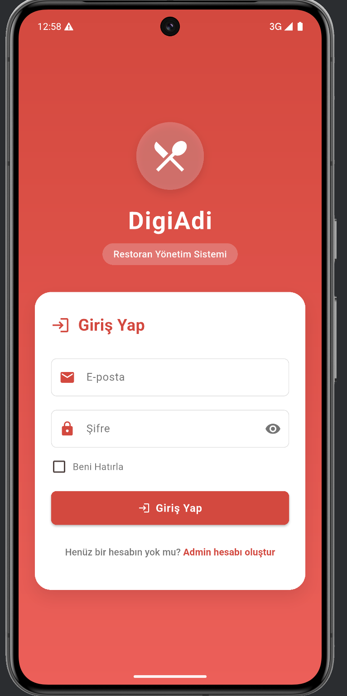
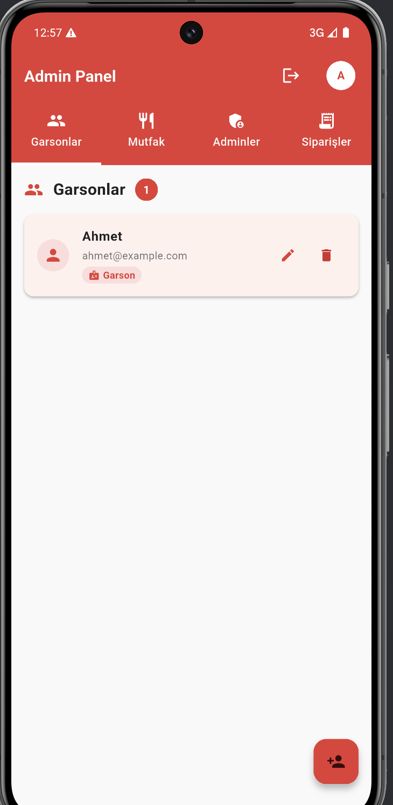
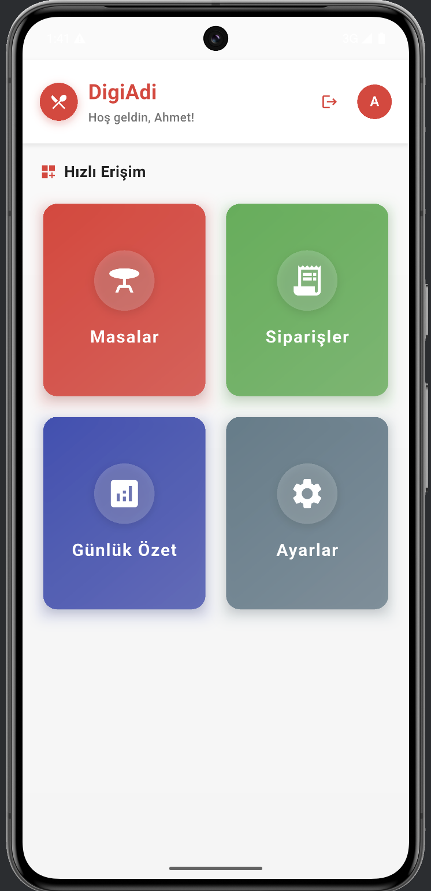
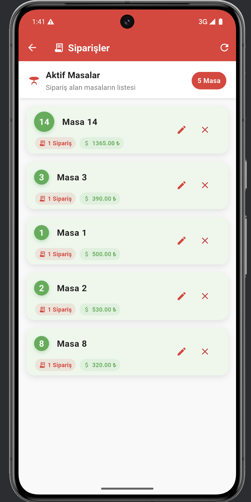
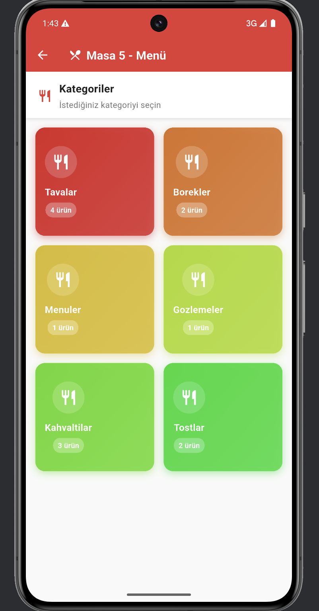
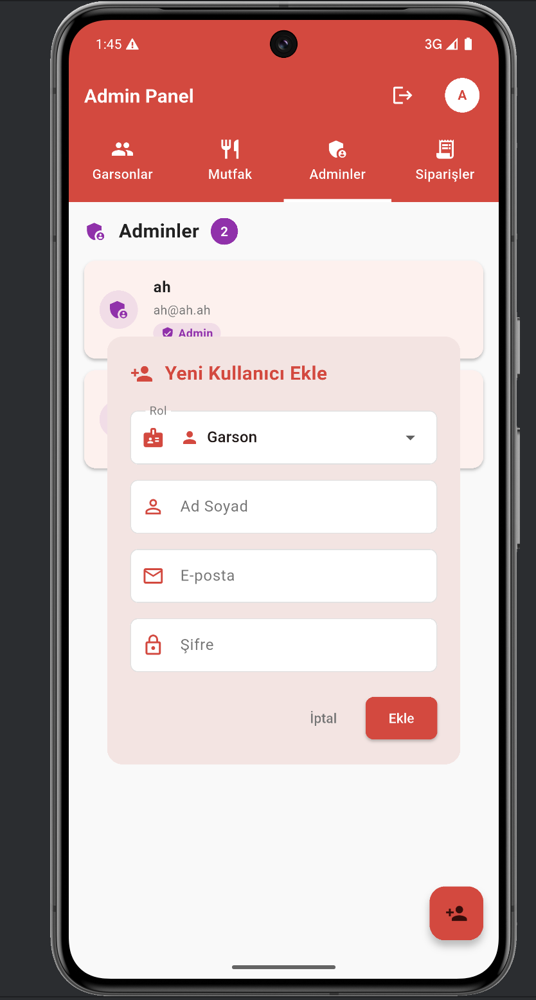

# Restoran Yönetim Sistemi

Bu proje, restoranlar için geliştirilmiş kapsamlı bir yönetim sistemidir. Flutter kullanılarak geliştirilmiş olan bu uygulama, restoran yöneticilerine, garsonlara ve mutfak personeline özel arayüzler sunmaktadır.

## 🚀 Özellikler

### Admin Paneli
- Kullanıcı yönetimi (Garson, Mutfak, Admin ekleme/düzenleme/silme)
- Sipariş takibi ve yönetimi
- Masa yönetimi
- Profil düzenleme
- Detaylı raporlama

### Garson Arayüzü
- Masa yönetimi
- Sipariş alma
- Sipariş durumu takibi
- Müşteri hizmetleri

### Mutfak Arayüzü
- Sipariş görüntüleme
- Sipariş durumu güncelleme
- Hazırlanan siparişleri işaretleme

## 🛠️ Teknolojiler

- **Frontend**: Flutter
- **Backend**: Node.js
- **Veritabanı**: MySQL
- **State Management**: Provider
- **HTTP Client**: http package
- **Local Storage**: SharedPreferences

## 📱 Ekran Görüntüleri

### Giriş ve Kayıt

*Kullanıcı giriş ekranı*


*Yeni kullanıcı kayıt ekranı*

### Admin Paneli

*Admin paneli ana ekranı - Kullanıcı yönetimi ve sipariş takibi*

### Personel Arayüzü

*Personel ana ekranı - Masa ve sipariş yönetimi*


*Sipariş alma ve düzenleme ekranı*

### Menü ve Profil

*Menü görüntüleme ekranı*


*Kullanıcı profil düzenleme ekranı*

## 🚀 Kurulum

1. Projeyi klonlayın:
```bash
git clone [proje-url]
```

2. Bağımlılıkları yükleyin:
```bash
flutter pub get
```

3. Uygulamayı çalıştırın:
```bash
flutter run
```

## 🔧 Gereksinimler

- Flutter SDK (2.0.0 veya üzeri)
- Dart SDK (2.12.0 veya üzeri)
- Android Studio / VS Code
- Backend sunucusu (Node.js)

## 👥 Kullanıcı Rolleri

### Admin
- Tüm kullanıcıları yönetebilir
- Siparişleri görüntüleyebilir ve yönetebilir
- Masaları kapatabilir
- Sistem ayarlarını yapabilir

### Garson
- Masa yönetimi yapabilir
- Sipariş alabilir
- Sipariş durumlarını takip edebilir

### Mutfak
- Siparişleri görüntüleyebilir
- Sipariş durumlarını güncelleyebilir
- Hazırlanan siparişleri işaretleyebilir

## 🔐 Güvenlik

- JWT tabanlı kimlik doğrulama
- Rol tabanlı yetkilendirme
- Şifreli veri iletişimi
- Güvenli oturum yönetimi

## 📝 Lisans

Bu proje MIT lisansı altında lisanslanmıştır. Detaylar için [LICENSE](LICENSE) dosyasına bakın.

## 👨‍💻 Geliştirici Ekibi

Bu proje, Abdullah Gül Üniversitesi öğrencileri tarafından geliştirilmiştir:

- Ahmet Karauz
- Ekin Tekin
- Hüseyin Alsancak
- Dilhan Deniz
- Selahattin Eyyup Yağmur

## 📞 İletişim

- Ahmet Karauz: ahmet.karauz@agu.edu.tr
- Ekin Tekin: ekin.tekin@agu.edu.tr
- Hüseyin Alsancak: huseyin.alsancak@agu.edu.tr
- Dilhan Deniz: dilhan.deniz@agu.edu.tr
- Selahattin Eyyup Yağmur: selahattin.eyyup.yagmur@agu.edu.tr
